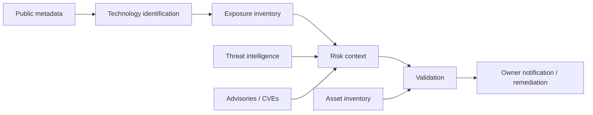

# AI Infrastructure OSINT

AI infrastructure is now a legitimate OSINT subject in its own right. Analysts increasingly need to understand publicly observable AI services, model ecosystems, agent frameworks and MLOps dependencies.

## Scope

Defensive AI-infrastructure OSINT can map:

- public service and product metadata;
- model registries and model cards;
- documented API and deployment surfaces;
- MCP and agent ecosystems;
- vector-database and retrieval-stack technologies;
- MLOps platforms and dependency relationships;
- public security advisories and exposure reports;
- package, container and software-supply-chain metadata;
- public incident, outage and vulnerability reporting.

## Reference resource

[7WaySecurity/ai_osint](https://github.com/7WaySecurity/ai_osint) is included as a verified curated reference because it focuses specifically on AI/ML infrastructure exposure, MCP/agent security, MLOps, vector databases, detection rules and threat intelligence.

The source repository itself uses an authorization-oriented `KEYWORD` convention to avoid turning its material into indiscriminate secret harvesting. OSINTAI adopts the same high-level principle: **scope discovery to assets and engagements you are authorized to assess**.

## Defensive intelligence model

## Evidence requirements

For each observation retain:

- source and retrieval time;
- asset ownership or authorization context;
- service fingerprint or public metadata used;
- confidence level;
- whether the observation was passive or required interaction;
- validation result;
- disclosure or remediation status where applicable.

## Agent and MCP exposure

Agentic systems create new public signals and new trust boundaries. Useful OSINT questions include:

- Which agent/MCP technologies are publicly documented by an organization?
- Which versions or packages appear in public repositories or SBOMs?
- Which capabilities are read-only versus state-changing?
- Which third-party services receive case or model data?
- Which security advisories apply to the observed software stack?

These questions are useful for defensive exposure management without requiring exploitation.

## Do not collapse exposure into compromise

A reachable service is not proof of vulnerability. A vulnerable version is not proof of exploitation. A leaked-looking string is not automatically a valid credential. OSINTAI keeps **observation**, **validation**, **risk inference** and **confirmed impact** as separate states.