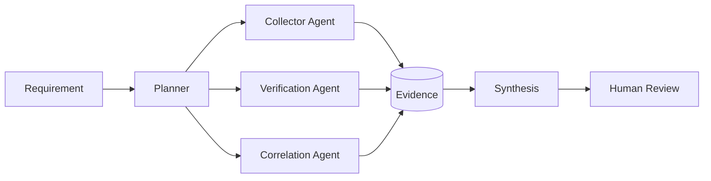

# OSINTAI Paradigms — v0.3

The field is moving beyond “use an LLM to summarize search results.” OSINTAI v0.3 tracks the deeper architectural shifts that are changing how investigations are collected, processed, verified and distributed.

## 1. Autonomous & Agentic OSINT

In this paradigm the model is not merely a text assistant. It can decompose a requirement, choose bounded tools, pivot from findings, compare sources and iterate toward a defined intelligence goal.

Representative examples:
- OpenOSINT
- Argus OS
- Argus by cotcollective
- FETIH
- S2W Deep Research Investigator
- MOSAIV as an academic multi-agent verification design
- Autonomous Video Hunter as a research prototype presented at Recon Village / DEF CON 33

### Architecture pattern



The defining characteristic is not “many agents.” It is **delegated decision-making over tools and evidence**.

## 2. Local-First & Zero-API OSINT

Local-first designs minimize the amount of investigative context that leaves analyst-controlled infrastructure.

Representative examples:
- cotcollective/argus
- OSINTai
- IntelHub
- WorldView
- Unburden
- local Ollama modes in multiple agentic platforms

This paradigm can combine:
- local LLM inference;
- local embeddings;
- local vector databases;
- local graph databases;
- local evidence stores;
- public/keyless sources;
- self-hosted MCP servers.

### Important distinction

**Local AI is not the same as offline OSINT.**

A locally running model may still query search engines, public APIs, DNS services, archives or remote websites. OSINTAI therefore separates:

1. **inference locality**;
2. **evidence storage locality**;
3. **collection locality**;
4. **third-party API dependence**;
5. **telemetry behavior**.

“Local-first” should never be used as a blanket privacy claim.

## 3. Emerging-Source Intelligence

New OSINT value increasingly comes from data classes that were previously ignored as operational exhaust.

### PromptINT

PromptINT treats publicly exposed LLM conversations and leaked system prompts as a new intelligence source class.

Potential intelligence value includes:
- workflow structure;
- decision rules;
- organizational terminology;
- system boundaries;
- authentication assumptions;
- operational dependencies.

These artifacts can also contain personal or confidential information. Public discoverability does not eliminate privacy, proportionality or disclosure obligations.

### Torrent Metadata OSINT

Recent research explores public torrent metadata as a source for behavioral and network-level analysis.

OSINTAI classifies this as **metadata intelligence**, not automatic identity attribution. Shared infrastructure, NAT, VPNs, relays and changing addresses make over-attribution especially dangerous.

### AI Infrastructure Metadata

AI endpoints, model registries, MCP ecosystems, model cards, package metadata, SBOMs and public incident reports are increasingly useful sources for defensive intelligence.

## 4. Continuous Multimodal Intelligence

Traditional OSINT frequently analyzes a static page, post, image or video. Newer systems increasingly operate across continuous streams.

Representative work:
- Autonomous Video Hunter
- MOSAIV
- Ægis
- WorldView
- AIL Framework

Relevant modalities:
- live video;
- still imagery;
- audio and speech;
- geospatial data;
- telemetry;
- text;
- documents;
- graph relationships.

The core challenge moves from “can the model detect it?” to:

**Can the system preserve provenance, time, source quality and uncertainty while processing at scale?**

## 5. Decentralized Intelligence Networks

A separate experimental paradigm distributes intelligence exchange or validation across decentralized infrastructure.

Examples:
- ShadowBroker / InfoNet
- Starcom (candidate)

Possible building blocks include:
- peer-to-peer messaging;
- distributed identity;
- signed events;
- decentralized storage;
- mesh networking;
- distributed validation or governance.

This space requires unusually skeptical verification. A decentralized protocol does not automatically provide:
- truth;
- privacy;
- anonymity;
- resistance to poisoning;
- reliable governance.

InfoNet's own current documentation explicitly labels privacy protections as incomplete and its testnet as experimental.

## 6. Intelligence-from-Unstructured-Data

AIL Framework demonstrates another important shift: screenshots, chats, PDFs, QR codes, images, hidden-service pages and files can become first-class structured intelligence objects.

The pipeline becomes:

```text
unstructured source
      ↓
capture
      ↓
OCR / decoding / QR / metadata / image description
      ↓
entities + indicators
      ↓
correlation
      ↓
search / graph / investigation
      ↓
analyst-reviewed intelligence
```

AI matters here because it can make previously opaque content searchable and correlatable. The value is not the generated description itself; the value is the **new searchable structure linked back to the original artifact**.

## Paradigm matrix

| Paradigm | Primary innovation | Representative resources |
|---|---|---|
| Autonomous OSINT | delegated planning + tool use | OpenOSINT, Argus, DRI, FETIH |
| Local-first | privacy/control of model and data plane | Argus, OSINTai, IntelHub, WorldView |
| Emerging-source intelligence | previously ignored source classes | PromptINT, torrent metadata, AI infrastructure |
| Continuous multimodal | real-time/multi-format analysis | AVH, MOSAIV, Ægis, AIL |
| Decentralized intelligence | distributed exchange/validation | InfoNet, Starcom |
| Unstructured intelligence | structure from messy content | AIL, multimodal pipelines |

Machine-readable definitions live in `catalog/paradigms.json`.
